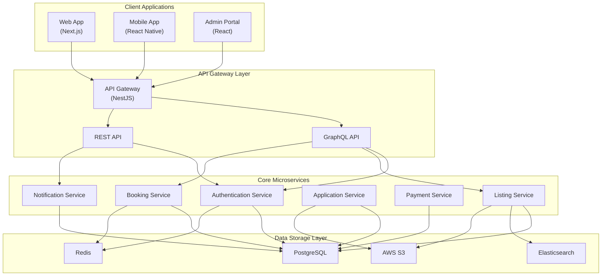

# Architecture Diagram

This diagram illustrates the architecture of the AirUAE platform.

```mermaid
flowchart TB
    subgraph ClientApps["Client Applications"]
        WebApp["Web App
(Next.js)"]
        MobileApp["Mobile App
(React Native)"]
        AdminPortal["Admin Portal
(React)"]
    end

    subgraph APILayer["API Gateway Layer"]
        Gateway["API Gateway
(NestJS)"]
        GraphQL["GraphQL API"]
        REST["REST API"]
    end

    subgraph CoreServices["Core Microservices"]
        AuthSvc["Authentication Service"]
        ListingSvc["Listing Service"]
        BookingSvc["Booking Service"]
        ApplicationSvc["Application Service"]
        PaymentSvc["Payment Service"]
        NotificationSvc["Notification Service"]
    end

    subgraph DataLayer["Data Storage Layer"]
        PostgreSQL["PostgreSQL"]
        ElasticSearch["Elasticsearch"]
        Redis["Redis"]
        S3["AWS S3"]
    end

    %% Client to API connections
    WebApp --> Gateway
    MobileApp --> Gateway
    AdminPortal --> Gateway
    
    %% API Gateway to Services
    Gateway --> GraphQL
    Gateway --> REST
    GraphQL --> AuthSvc
    GraphQL --> ListingSvc
    GraphQL --> BookingSvc
    REST --> AuthSvc
    REST --> NotificationSvc

    %% Services to Data Layer
    AuthSvc --> PostgreSQL
    AuthSvc --> Redis
    ListingSvc --> PostgreSQL
    ListingSvc --> ElasticSearch
    ListingSvc --> S3
    BookingSvc --> PostgreSQL
    BookingSvc --> Redis
    ApplicationSvc --> PostgreSQL
    ApplicationSvc --> S3
    PaymentSvc --> PostgreSQL
    NotificationSvc --> PostgreSQL
```

